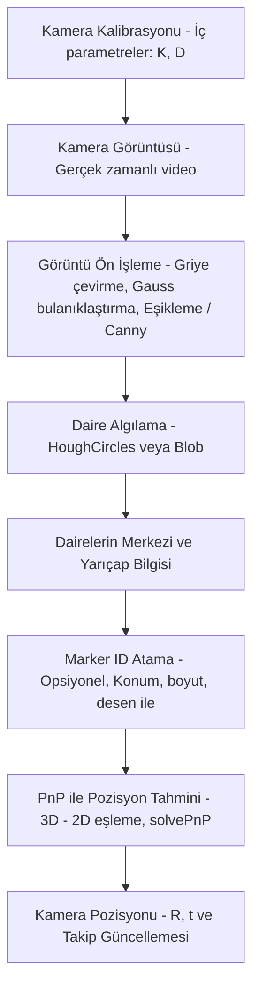
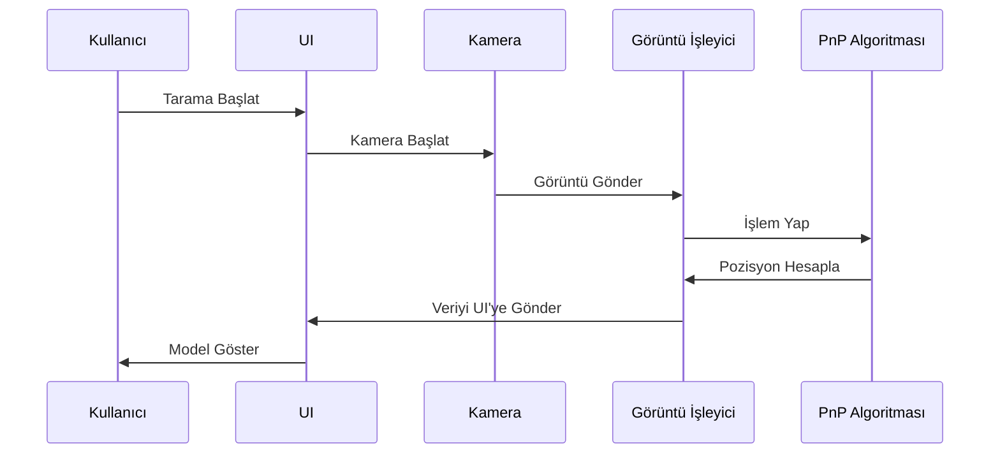
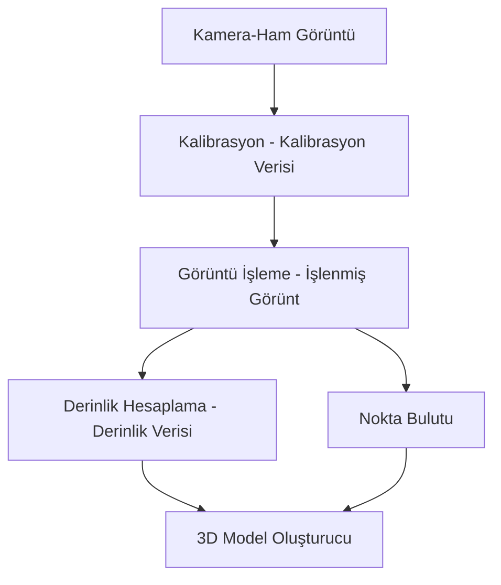
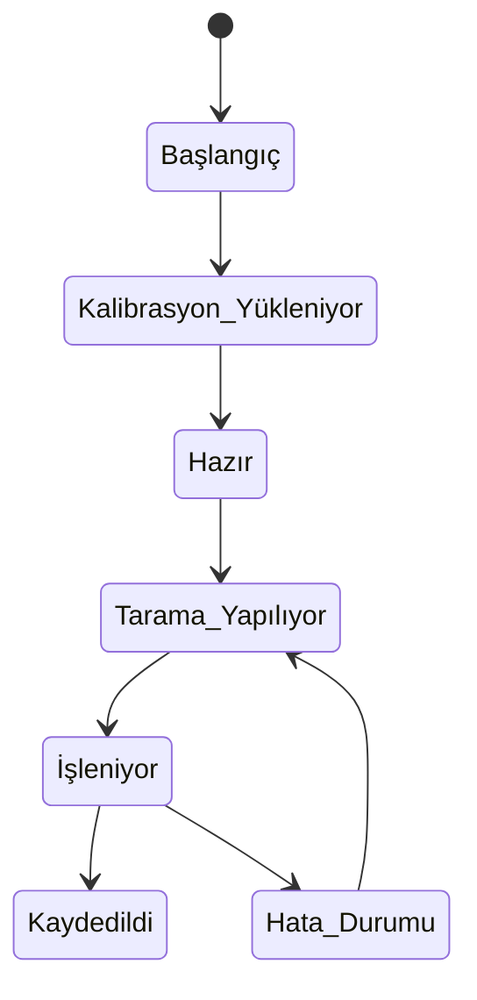
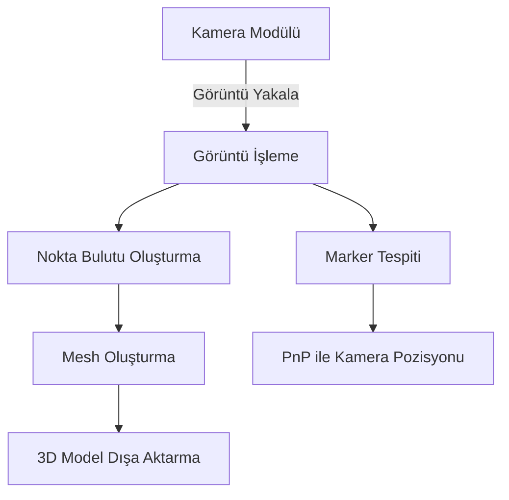

# Yazılım Gereksinimleri Belirtimi (SRD)

> **Belge Türü**: Teknik Dokümantasyon
> **Proje**: 3B Tarama Cihazı
> **Versiyon:** 1.1
> **Tarih:** 18.03.2025

## Revizyon Geçmişi

| Tarih      | Açıklama | Yazar                   | Yorumlar                |
| ---------- | ---------- | ----------------------- | ----------------------- |
| 18.03.2025 | V1.0       | Ahmet Furkan KARAARSLAN | Doküman başlangıç   |
| 2.04.2025  | V1.1       | Muammer Tiryaki         | Küçük güncellemeler |

---

## İçindekiler

- [1. Giriş](#1-giriş)
  - [1.1 Amaç](#11-amaç)
  - [1.2 Kapsam](#12-kapsam)
  - [1.3 Tanımlar ve Kısaltmalar](#13-tanımlar-ve-kısaltmalar)
  - [1.4 Referanslar](#14-referanslar)
  - [1.5 Genel Bakış](#15-genel-bakış)
- [2. Genel Açıklama](#2-genel-açıklama)
  - [2.1 Ürün Perspektifi](#21-ürün-perspektifi)
  - [2.3 Ürün İşlevleri](#23-ürün-i̇şlevleri)
  - [2.3 Kullanıcı Özellikleri](#23-kullanıcı-özellikleri)
  - [2.4 Genel Sınırlamalar](#24-genel-sınırlamalar)
  - [2.5 Varsayımlar ve Bağımlılıkları](#25-varsayımlar-ve-bağımlılıkları)
- [3. Özel Gereksinimler](#3-özel-gereksinimler)
  - [3.1 Dış Arabirimi Gereksinimleri](#31-dış-arabirimi-gereksinimleri)
  - [3.2 Fonksiyonel Gereksinimleri](#32-fonksiyonel-gereksinimleri)
  - [3.3 Kullanım Durumları](#33-kullanım-durumları)
  - [3.4 Sınıflar / Nesneler](#34-sınıflar--nesneler)
  - [3.5 İşlevsel Olmayan Gereksinimler](#35-i̇şlevsel-olmayan-gereksinimler)
  - [3.6 Ters Gereksinimleri](#36-ters-gereksinimleri)
  - [3.7 Tasarım Kısıtlamaları](#37-tasarım-kısıtlamaları)
  - [3.8 Mantıksal Veritabanı Gereksinimleri](#38-mantıksal-veritabanı-gereksinimleri)
  - [3.9 Diğer Gereksinimler](#39-diğer-gereksinimler)
- [4. Analiz Modelleri](#4-analiz-modelleri)
  - [4.1 Aktivite Diyagramları](#41-aktivite-diyagramları)
  - [4.2 Sequence Diyagramları](#42-sequence-diyagramları)
  - [4.3 Veri Akış Diyagramları](#43-veri-akış-diyagramları)
  - [4.4 Durum Geçişi Diyagramları](#44-durum-geçişi-diyagramları)
- [5. Değişiklik Yönetimi Süreci](#5-değişiklik-yönetimi-süreci)
- [A. Ekler](#a-ekler)
  - [A.1 Ek 1](#a1-ek-1)

## 1. Giriş

### 1.1 Amaç

Bu doküman, 3D tarama cihazı yazılımının işlevsel ve işlevsel olmayan gereksinimlerini tanımlamaktadır. Yazılımın amacı, lazer tabanlı yapılandırılmış ışık desenlerini yakalamak, stereo kamera kurulumu kullanarak noktu bulutunu çıkarmak, kamera konumunu belirlemek için marker tabanlı PnP algoritmasını kullanmak ve görüntüleri işleyerek hassas 3D modellerin çıktı olarak oluşturulmasını sağlamaktır.

Üretilecek olan yazılım ve donanım Kickstarter (Fonlama ile satış) projesinde farklı paketler (Stereo kamera, Structured Light, Stereo Kamera + Structured Light, Infrared Light, Infrared Light+ Stereo kamera veya hepsi için mono kamera) şeklinde piyasaya sürülecektir.

Proje içerisinde elektronik tasarım ve yazılım tasarımı olarak ikiye ayrılmaktadır. Tasarlanan yazılımın SDK (Software Development Kit) şeklinde açık kaynak olarak yayınlanarak geri dönüşler alarak yazılımın geliştirilmesi hedeflenmektedir. Elektronik tasarım ise SDK ile bütünleşik çalışıp kapalı kaynak benimsenmesi sağlanacaktır.

### 1.2 Kapsam

Bu yazılım aşağıdaki işlevleri sağlayacaktır:

* Lazer tarama sistemi ve kamera ile yüksek çözünürlüklü görüntüler yakalama.
* İki kamera (stereo kamera) kullanılarak derinlik bilgisi elde edilerek nokta bulutu elde etme.
* Kamera kalibrasyonun yapılabilmesi.
* Görüntü işleme algoritmalarını kullanarak 3D nokta bulutları oluşturma.
* Kamera konumlarının işaretçi tabanlı PnP algoritması ile belirlenmesi.
* Tarama ve veri dışa aktarma işlemleri için etkileşimli bir kullanıcı arayüzü sağlama.
* Birden fazla çıktı formatını destekleme (PCL, STL, OBJ, PLY).
* Tarama hızı ve doğruluğunu optimize etme.
* Elde edilen nokta bulutları üzerinde farklı algoritmalarının denenmesi ve denenilen algoritmaların etkisinin kontrol edilmesi için test arayüzünün oluşturulması, algoritma nokta bulutuna uygulandıktan sonra algoritmanın etkisinin gözle kontrol edilmesi.
* Python SDK ile kullanıcıların hem ham görüntü verilerini hem de ön işlemden geçmiş en azından PCL olarak işlenmiş verileri alabilmesi hedeflenmektedir.

Bu elektronik sistem aşağıdaki işlevleri sağlayacaktır:

* Birbirinden bağımsız noktada kitler bulunması hedeflenmektedir.
* Kit ana bilgisayara ya da hesaplama birimine kablolu ya da kablosuz olarak bağlanacaktır.
* Çeşitli modüller eş zamanlı piyasaya sürülecektir:

  * |          | Kamera           | Kaynak             | Sensör | Haberleşme | FPGA ya da SOM |
    | -------- | ---------------- | ------------------ | ------- | ----------- | -------------- |
    | Modül 1 | mono RGB         | IR led pattern     | IMU     | kablolu     | var            |
    | Modül 2 | mono RGB         | MAVİ pattern      | IMU     | kablosuz    | var            |
    | Modül 3 | stereo RGB       | IR pattern         | IMU     | kablolu     | yok            |
    | Modül 4 | stereo Monokrome | Kırmızı pattern | IMU     | kablosuz    | yok            |
* Bu modül kombinasyonu daha sonra belirlenecektir.
* Modüller üzerinde bulunabilecek ISP ve dahili FPGA/SOM gibi yapılar araştırılacaktır.
* Modüller eğer kablosuz tasarlanabiliyorsa batarya modülü de eklenecektir.

### 1.3 Tanımlar ve Kısaltmalar

* Lazer Tarama: Bir nesneye belirli lazer desenlerinin yansıtılması ve kameradan alınan görüntülerin analiz edilerek 3D model oluşturulması tekniği.
* Stereo Kamera: Derinlik algısı oluşturmak için iki farklı açıdan görüntü yakalayan çift kamera sistemi.
* PnP (Perspective-n-Point): Kameranın 3D uzaydaki konumunu belirlemek için marker tabanlı konumlandırma yöntemi.
* Nokta Bulutu: Tarama yüzeyini temsil eden 3D veri noktalarından oluşan yapı.
* STL (Stereolithography): CAD ve 3D baskı için yaygın olarak kullanılan bir 3D dosya formatı.
* Structured Light: Yapılandırılmış ışık, üç boyutlu bir nesnenin şeklini ve derinliğini, nesnenin yüzeyine bir ışık deseni yansıtarak ölçen bir yöntemdir. Desen şeritler, ızgaralar veya noktalar olabilir.
* Mono kamera: Tekli kamera kurulumu.
* IMU: Kameraların konum lokasyon takibi yapabilmesi ve birbirlerine göre referanslanabilmesini sağlayacaktır.
* FPGA ya da SOM: Eğer gerekirse modüller üzerinde dahili işlem birimi ile PCL verilerinin aktarılabilmesi sağlanacaktır.

### 1.4 Referanslar

* OpenCV Dokümantasyonu (Görüntü işleme için)
* Kamera Kalibrasyonu [https://docs.opencv.org/4.x/dc/dbb/tutorial_py_calibration.html](https://docs.opencv.org/4.x/dc/dbb/tutorial_py_calibration.html)
* PCL (Point Cloud Library) Dokümantasyonu
* Agile Yazılım Geliştirme İlkeleri
* Open3D Dokümantasyonu
* Kickstarter
* Kullanılacak kamera e-con system'e ait monochroma ve RGB kameralardır.

### 1.5 Genel Bakış

Bu belge, 3B tarama cihazı yazılımının işlevsel ve işlevsel olmayan tüm gereksinimlerini ayrıntılı biçimde açıklar. Belge, yazılımın amacını, kapsamını, teknik altyapısını, kullanıcı arayüzlerini, donanım ve yazılım arabirimlerini, kullanım senaryolarını, sınıf ve nesne yapısını, performans beklentilerini ve tasarım kısıtlarını içermektedir.

Doküman aşağıdaki bölümlerden oluşmaktadır:

* Giriş: Projenin amacı, kapsamı, terminolojisi
* Genel Açıklama: Ürünün genel yapısı ve kullanım alanları
* Özel Gereksinimler: Fonksiyonel ve işlevsel olmayan gereksinimler
* Analiz Modelleri: Diyagramlar ve iş akışları
* Değişiklik Yönetimi: Gereksinimlerin nasıl güncelleneceği

## 2. Genel Açıklama

### 2.1 Ürün Perspektifi

Yazılım, harici donanımlarla (kameralar, lazer kaynağı) etkileşime giren bağımsız bir uygulama ve donanım olarak tasarlanacaktır ve kullanıcıya gerçek zamanlı geri bildirim sağlayacaktır.

Yazılım, üç farklı 3D tarama yöntemi için destek sağlayacaktır:

1. Stereo Kamera Yöntemi: İki farklı kameradan alınan görüntüler arasındaki paralaks farkı kullanılarak derinlik bilgisi elde edilir.
2. Lazer Tabanlı Yapılandırılmış Işık Yöntemi: Bir projeksiyon kaynağı aracılığıyla nesne üzerine belirli desenler yansıtılarak, kameradan bu desenlerin deformasyonu analiz edilir ve 3D model oluşturulur.
3. Stereo Kamera + Lazer Tabanlı Yapılandırılmış Işık Yöntemi: Stereo kamera ve lazer(hem görünür ışık hem IR ışık için) tabanlı yapılandırılmış ışık yöntemlerinin birleşimi ile daha yüksek doğruluk elde edilir. Stereo kameralar derinlik haritasını çıkarırken, lazer ile detaylı yüzey bilgisi sağlanır.

### 2.3 Ürün İşlevleri

* Görüntü Yakalama: Kameradan ham görüntülerin alınması.
* Lazer Tabanlı Yapılandırılmış Işık İşleme: Algoritmalarla derinlik bilgisi çıkarma.
* 3D Modelleştirme: Derinlik verisini nokta bulutuna ve mesh yapısına dönüştürme.
* Kamera Konumu Belirleme: Marker tabanlı PnP algoritması kullanarak kameranın konumunun hesaplanması.
* Yazılım üzerinden kullanıcının işlevlere sahip olmasını sağlama.
* Eğer birden fazla kamera modülü bir sisteme takılıysa bunlar arasında kolerasyon kurulması.
* Dosya Dışa Aktarma: Sonuçları endüstri standardı 3D dosya formatlarında kaydetme.
* Kullanıcı Arayüzü: Tarama başlatma, durdurma ve dosya yönetimi gibi özellikler sunma.

### 2.3 Kullanıcı Özellikleri

### 2.4 Genel Sınırlamalar

* Yazılım sadece uyumlu kamera ve lazer donanımı ile çalışacaktır.
* Gerçek zamanlı veri işleme için belirli bir sistem konfigürasyonu (örn. minimum i7 işlemci, 32GB RAM ya da Nvidia CUDA) gereklidir.
* Işık koşulları, tarama kalitesini etkileyebilir. Yetersiz aydınlatma durumlarında tarama doğruluğu azalabilir. Bu tarz tespitler ile sistem modülleri arasına ek ürünler geliştirilecektir.
* Başlangıçta yalnızca Ubuntu 22.04 işletim sistemi üzerinde çalışacaktır. Ardından Python/C++ SDK ile diğer sistemlerde de çalışabilir hale getirilecektir.

### 2.5 Varsayımlar ve Bağımlılıkları

* Tarama işlemi için uyumlu bir kamera ve lazer kaynağı gereklidir.
* Kamera konumu, marker tabanlı PnP algoritması kullanılarak tespit edilecektir.
* Görüntü ve 3D işlemleme için OpenCV ve PCL gibi harici kütüphaneler kullanılacaktır.
* Birden fazla kamera kullanılan durumlarda kameraların birbirlerine göre konumu hassas olarak girilmesi beklenebilir.

## 3. Özel Gereksinimler

### 3.1 Dış Arabirimi Gereksinimleri

#### 3.1.1 Kullanıcı Arayüzleri

* Ana ekran: Tarama başlatma, durdurma ve ayarları barındırır.
* Önizleme alanı: Gerçek zamanlı görüntü akışı ve oluşturulan 3D modelin önizlemesi gösterilir.
* Ayarlar paneli: Kalibrasyon verileri, çözünürlük ve çıktı formatı gibi ayarlar yapılır.
* Çıktı ekranı: Tarama sonucu 3D modelin kaydedileceği format ve konum seçilir.

#### 3.1.2 Donanım Arabirimleri

* 2 adet USB 3.0 bağlantı noktası (stereo kamera için)
* Lazer tarayıcı için harici güç bağlantısı(Şimdilik)
* Donanım tetikleyici (opsiyonel) ile senkron görüntü alma desteği
* İleriki modellerde geniş bant üzerinden veri aktarımını sağlayabilmek için ETH, Fiber kablo ya da Wi-Fi düşünülmektedir.
* Modül üzerinde dahili batarya

#### 3.1.3 Yazılım Arabirimleri

* OpenCV: Görüntü işleme ve kamera kalibrasyonu için
* PCL: Nokta bulutu oluşturma ve işleme için, 3D görselleştirme ve çıktı alma işlemleri için
* USB kamera SDK’sı (e-con Systems)

#### 3.1.4 İletişim Arabirimleri

* USB 3.0 üzerinden kamera veri akışı

### 3.2 Fonksiyonel Gereksinimleri

| ID    | Gereksinim Açıklaması                                                                                                                                           |
| ----- | ------------------------------------------------------------------------------------------------------------------------------------------------------------------ |
| FG-1  | Sistem bağlı kameradan görüntü yakalayabilmelidir.                                                                                                            |
| FG-2  | Yazılım lazer tabanlı yapılandırılmış ışık desenlerini algılayıp analiz edebilmelidir.                                                                |
| FG-3  | Sistem yakalanan görüntülerden 3D nokta bulutu oluşturabilmelidir.                                                                                             |
| FG-4  | Kullanıcı tarama çözünürlüğünü ve parametreleri ayarlayabilmelidir.                                                                                      |
| FG-5  | Sistem 3D modelleri STL, OBJ ve PLY formatlarında dışa aktarabilmelidir.                                                                                        |
| FG-6  | Kullanıcı arayüzü, tarama başlatma, durdurma ve kaydetme işlemlerine izin vermelidir.                                                                        |
| FG-7  | Kamera konumu, işaret tabanlı PnP algoritması ile tespit edilmelidir.                                                                                           |
| FG-8  | Nokta bulutları üzerinde denenilecek olan algoritmalar için öncesi ve sonrası şeklinde görüntüler vermelidir.                                             |
| FG-9  | Görüntü hem dinamik olarak hem de kullanıcının isteğine göre “space” tuşuna bastıkça kameradan görüntü alacak şekilde iki seçenekli olmalıdır. |
| FG-10 | İşaretçi takibi kaybedildiği zaman kullanıcıyı bilgilendirmek için ekranda uyarı vermeli ve kamera konumu belirlenene kadar tarama durdurulmalıdır.     |

#### 3.2.1  Fonksiyonel Gereksinim #1: Görüntü Yakalama ve Tarama

Giriş: Stereo kamera görüntüleri

Girişler: Kalibrasyon verileri (K1, D1, K2, D2)
İşleme: Stereo eşleme algoritması ile derinlik haritası üretimi

Çıkışlar: 3D nokta bulutu
Hata işleme: Kalibrasyon eksikse uyarı verilir, düşük eşleşme kalitesi tespit edilirse kullanıcıya bildirim yapılır.

#### 3.2.2 Fonksiyonel Gereksinim #2: 3D Modelin Oluşturulması ve Dışa Aktarımı

* Giriş: Nokta bulutu, kullanıcı tarafından seçilen parametreler
* İşleme: Noktalar mesh'e dönüştürülür, gerekli dosya formatı oluşturulur
* Çıkışlar: STL, OBJ, PLY formatında dosyalar
* Hata İşleme: Yazma izni olmayan klasör seçilirse kullanıcı uyarılır, boş tarama verisi varsa işlem durdurulur.

### 3.3 Kullanım Durumları

#### 3.3.1 Kullanım Durumu #1: Nesne Tabanlı 3D Tarama

Amaç:
 Gerçek dünya ortamındaki bir nesnenin yüzey geometrisinin yüksek hassasiyetle taranarak bilgisayar ortamında 3B model olarak elde edilmesi.

Aktörler:
 Kullanıcı (operatör)

Ön Koşullar:

* Kamera ve lazer sistemi düzgün çalışıyor olmalı
* Kalibrasyon tamamlanmış olmalı
* Marker’lar sistemin görebileceği şekilde düzgün konumlandırılmış olmalı
* Marker tanımları yazılıma önceden tanıtılmış olmalı

Senaryo:

1. Kullanıcı sistemi başlatır.
2. Marker’lar kameralar tarafından algılanır ve PnP algoritması ile pozisyon tespiti yapılır.
3. Kamera ve lazer otomatik olarak senkronize çalışmaya başlar.
4. Kullanıcı nesneyi sabit konumda yerleştirir.
5. Sistem görüntüleri yakalar, işleyip nokta bulutu oluşturur.
6. Nokta bulutu 3B modele dönüştürülür.
7. Kullanıcı çıktıyı .STL veya .PLY formatında kaydeder.

Sonuç:
 Tarama başarıyla tamamlanır ve 3D model elde edilir.

#### 3.3.2 Kullanım Durumu #2: Medikal Tarama – Uzuv Modelleme

Amaç:
 Medikal sektöründe kullanılmak üzere insan uzuvlarının hassas şekilde taranarak dijital ortama aktarılması.

Aktörler:
 Kullanıcı (teknisyen), hasta

Ön Koşullar:

* Kişi hareketsiz pozisyonda durmalı
* Kalibrasyon dosyaları önceden hazırlanmış olmalı
* Marker’lar sistem görüş alanında net şekilde sabitlenmiş olmalı
* Ortam ışığı yetersiz değilse ek aydınlatma sağlanmalı

Senaryo:

1. Kullanıcı hastayı tarama alanına yerleştirir.
2. Marker'lar algılanır, sistem pozisyonunu doğrular.
3. Tarama çözünürlüğü “yüksek” olarak seçilir.
4. Sistem birkaç saniyelik görüntü alımı yapar.
5. Elde edilen nokta bulutu yüzey yumuşatma ile optimize edilir.
6. Model, ortopedik kalıp üretimi için dışa aktarılır.

Sonuç:
 Hasta uzvunun dijital modeli alınmış ve üretime hazır hâle getirilmiştir.

---

#### 3.3.3 Kullanım Durumu #3: Algoritma Karşılaştırma Modu (Test Arayüzü)

Amaç:
 Yeni nokta bulutu filtreleme veya yüzey iyileştirme algoritmalarını test etmek ve etkilerini görsel olarak karşılaştırmak.

Aktörler:
 Geliştirici veya araştırmacı kullanıcı

Ön Koşullar:

* Marker’lar yazılımda tanıtılmış olmalı (eğer canlı tarama yapılacaksa)
* Mevcut veya önceden taranmış nokta bulutu verisi sisteme yüklenebilir olmalı

Senaryo:

1. Kullanıcı mevcut bir nokta bulutunu yazılıma yükler.
2. Farklı filtreleme algoritmaları listeden seçilir.
3. Yazılım aynı veri üzerinde önce/sonra karşılaştırması yapar.
4. Kullanıcı görsel çıktılar üzerinden karar verir.

Sonuç:
 Algoritmaların performansı test edilmiş olur, ileri geliştirmeler yapılabilir.

### 3.4 Sınıflar / Nesneler

#### 3.4.1 Sınıf / Nesne  #1: KameraModülü

Öznitelikler: ID, çözünürlük, fps, kalibrasyon parametreleri

İşlevler: GörüntüAl(), KalibrasyonYükle(), VideoAkışıBaşlat()

Referans: FG-1, FG-7

<Fonksiyonel gereksinimlere ve/veya kullanım durumlarına referans>

#### 3.4.2 Sınıf / Nesne #2: Nokta Bulutu İşleyici

Öznitelikler: Nokta listesi, filtreleme parametreleri

İşlevler: Oluştur(), Filtrele(), Kaydet()

Referans: FG-3, FG-5, FG-8

### 3.5 İşlevsel Olmayan Gereksinimler

#### 3.5.1 Performans

Kamera ve yapısal ışıktan elde edilecek nokta bulutları sistem üzerinden donma olmadan akıcı bir şekilde minimum 15 fps’te görüntüleyebilmelidir.

#### 3.5.2 Güvenilirlik

Elde edilen nokta bulutlarının kusursuza yakın olması ve taramada elde edilen obje ile gerçek dünyadaki objenin aynı boyutta olması hedeflenmektedir.

#### 3.5.3 Kullanılabilirlik

* Kullanıcı arayüzü sade ve sezgisel olacak şekilde tasarlanmalıdır. Kullanıcılar, temel eğitimle tüm tarama işlemlerini gerçekleştirebilecektir.

#### 3.5.4 Güvenlik

* Yazılım, kullanıcı erişim kontrolü sağlamasa da yalnızca yerel sistemde çalışır. Hassas veriler şifreli biçimde saklanmaz.

#### 3.5.5 Sürdürülebilirlik

* Yazılım açık kaynak kodlu olarak geliştirilecek, topluluk katkıları ile güncellemeler sürdürülebilecektir.

#### 3.5.6 Taşınabilirlik

* Kodlar platformdan bağımsız olarak C++ ve Python ile yazılacak, ancak başlangıçta yalnızca Ubuntu 22.04 işletim sisteminde çalışacaktır.

### 3.6 Ters Gereksinimleri

* Yazılım çevrimdışı çalışacak, bulut bağlantısı olmadan tüm işlevlerini gerçekleştirecektir.

### 3.7 Tasarım Kısıtlamaları

Bu yazılım projesini etkileyen bazı tasarım kısıtlamaları aşağıda belirtilmiştir:

* Donanım Kaynak Sınırlamaları: Cihazın çalışabilmesi için minimum donanım gereksinimleri vardır. Özellikle yüksek çözünürlüklü stereo görüntülerin işlenmesi ve 3D nokta bulutu oluşturma süreçleri yüksek işlem gücü ve bellek gerektirdiğinden, sistemin en az Intel i7 işlemci, 32GB RAM ve SSD depolama alanına sahip olması beklenmektedir.
* Gerçek Zamanlı İşleme Kısıtlaması: Kameralardan gelen veri akışının eş zamanlı olarak işlenebilmesi için işlem gecikmelerinin minimumda tutulması gerekmektedir. Bu durum yazılımın modüler ve hızlı çalışan algoritmalarla geliştirilmesini zorunlu kılar.
* Kamera Uyumluluğu: Yazılım yalnızca belirli USB 3.0 stereo kameralarla (ör. e-con Systems IMX900) uyumlu olacak şekilde geliştirilecektir. Diğer marka/model kameralarla uyumluluk garanti edilmemektedir.
* İşletim Sistemi Uyumluluğu: Yazılım sadece Ubuntu 22.04 LTS işletim sistemi üzerinde test edilip çalıştırılacaktır. Diğer işletim sistemleri için destek sağlanmamaktadır.
* Çevrimdışı Çalışma: Uygulama tamamen çevrimdışı çalışacak şekilde tasarlandığından, bulut tabanlı depolama veya işlem hizmetleri kullanılmayacaktır.

### 3.8 Mantıksal Veritabanı Gereksinimleri

Bu sistemde merkezi bir veritabanı kullanılmayacaktır. Ancak yapılan tarama işlemlerine ait metadata’lar JSON formatında klasörlerde saklanacaktır. Dosya yapısı hiyerarşik olacaktır.

### 3.9 Diğer Gereksinimler

* Yazılım açık kaynak lisans (MIT veya GPL) ile yayınlanacaktır.
* Tüm çıktılar kullanıcı dizinine otomatik olarak kaydedilecek, işlem sonunda otomatik olarak klasör açılacaktır.
* Uygulama terminal çıktıları ile hata mesajları ve debug bilgilerini kullanıcıya gösterecektir.

## 4. Analiz Modelleri

### 4.1 Aktivite Diyagramları

Kamera Pozisyonun Bulunması

Genel Yazılım Mimarisi

…

### 4.2 Sequence Diyagramları

### 4.3 Veri Akış Diyagramları

### 4.4 Durum Geçişi Diyagramları

## 5. Değişiklik Yönetimi Süreci

Bu yazılım gereksinimleri dokümanında yapılacak her türlü değişiklik, kontrollü ve izlenebilir bir süreç çerçevesinde yürütülecektir. Aşağıda bu sürecin detayları yer almaktadır:

#### 5.1 Değişiklik Talebi

* Herhangi bir ekip üyesi, müşteri ya da paydaş sistem gereksinimlerinde değişiklik önerisinde bulunabilir.
* Değişiklik talepleri yazılı olarak ve gerekçesiyle birlikte Değişiklik Talep Formu (veya GitHub Issues üzerinden) ile sunulmalıdır.

#### 5.2 Değerlendirme ve Etki Analizi

* Değişiklik talepleri, proje yöneticisi ve teknik ekip tarafından değerlendirilir.
* Her değişikliğin teknik fizibilitesi, zaman/maliyet etkisi ve mevcut sistem üzerindeki etkisi analiz edilir.
* Gerekirse, müşteriyle tekrar iletişime geçilerek kapsam netleştirilir.

#### 5.3 Onay ve Uygulama

* Uygun bulunan değişiklikler, proje yöneticisi tarafından onaylanarak resmi revizyonlara dahil edilir.
* İlgili yazılım bileşenleri, test planları ve dokümantasyon bu değişikliğe göre güncellenir.

#### 5.4 Versiyonlama ve Kayıt

* Her değişiklik dokümana revizyon numarası, tarih, yazar ve açıklama ile birlikte kaydedilir.
* Değişiklik geçmişi “Revizyon Geçmişi” bölümünde tutulur.
* Git üzerinden sürüm kontrolü sağlanır (örn. v1.1, v1.2-beta gibi).

#### 5.5 İletişim ve Paylaşım

* Onaylanan değişiklikler ilgili tüm ekip üyeleriyle paylaşılır.
* Yeni versiyonlar yazılım deposunda ve proje belgelerinde açıkça belirtilir.

## A. Ekler

<<<<<<< HEAD
=======
Ekler, ilave ve yararlı bilgi sağlamak için kullanılabilir. Varsa, belirtim açıkça ekinde yer alan bilgilerin belirtimde ifade edilen gereksinimlerin bir parçası olarak dikkate alınması gerekiyor belirtilmelidir.

Örnek Ekler (ilk) yazılım projesi için kavramsal belgeler, pazarlama materyalleri, müşteri ler ile toplantıların içeriğini vs.içerebilir.

### A.1 Ek 1

## Etkileşimli Diyagramlar

GitHub Pages'de Mermaid diyagramları kullanabilirsiniz. Örnek:

### Proje İlerleme Takibi

- **Gereksinimlerin Belirlenmesi**: Tamamlandı (2 Nisan 2025)
- **Mimari Tasarım**: Devam Ediyor
- **Prototip Geliştirme**: Planlanan (15 Mayıs 2025)

## Kod Değişikliği Güncellemeleri

<!-- LATEST_CODE_CHANGES -->
## 2025-04-02 11:55 Tarihli Kod Değişiklikleri

Commit: 43ffc96 - Add System Requirements Document (SRD) and update project progress tracking

### Değiştirilen Dosyalar

>>>>>>> fe91b90435f7fc9f2f1a215cb59b60fa2646f548

<!-- END_LATEST_CODE_CHANGES -->
