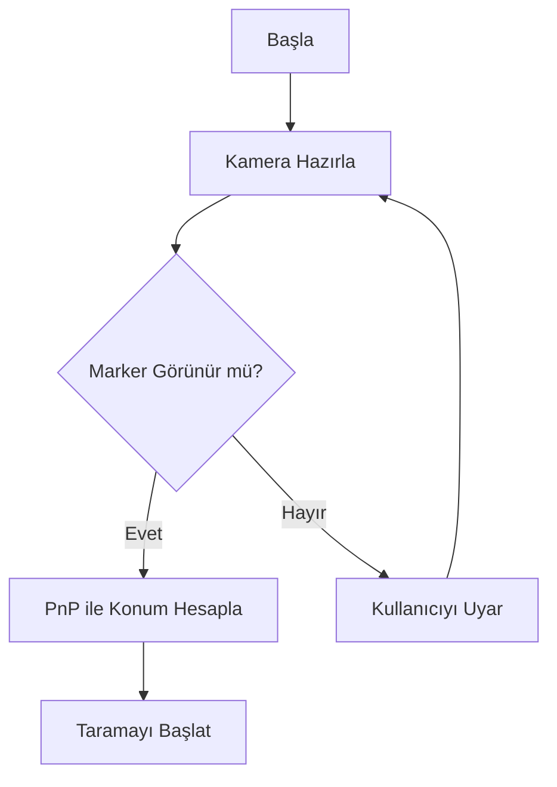
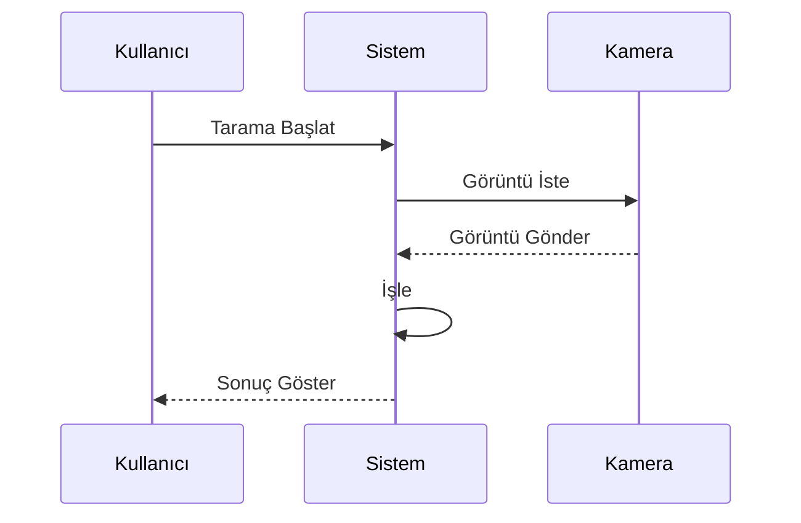
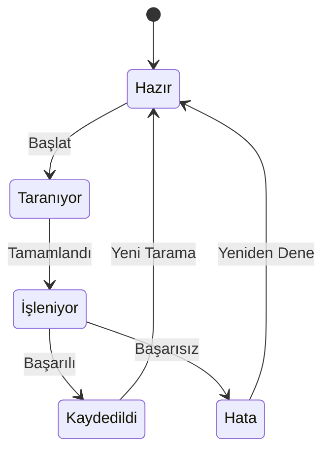

# Diyagram Örnekleri

Bu sayfa Mermaid.js kullanılarak oluşturulmuş diyagram örneklerini gösterir.

## Akış Diyagramı

```mermaid
graph TD
    A[Başla] --> B[Kamera Hazırla]
    B --> C{Marker Görünür mü?}
    C -- Evet --> D[PnP ile Konum Hesapla]
    C -- Hayır --> E[Kullanıcıyı Uyar]
    D --> F[Taramayı Başlat]
    E --> B
```

## Sequence Diyagramı

```mermaid
sequenceDiagram
    participant K as Kullanıcı
    participant S as Sistem
    participant KM as Kamera
    K->>S: Tarama Başlat
    S->>KM: Görüntü İste
    KM-->>S: Görüntü Gönder
    S->>S: İşle
    S-->>K: Sonuç Göster
```

## Durum Diyagramı

```mermaid
stateDiagram-v2
    [*] --> Hazır
    Hazır --> Taranıyor: Başlat
    Taranıyor --> İşleniyor: Tamamlandı
    İşleniyor --> Kaydedildi: Başarılı
    İşleniyor --> Hata: Başarısız
    Hata --> Hazır: Yeniden Dene
    Kaydedildi --> Hazır: Yeni Tarama
```
