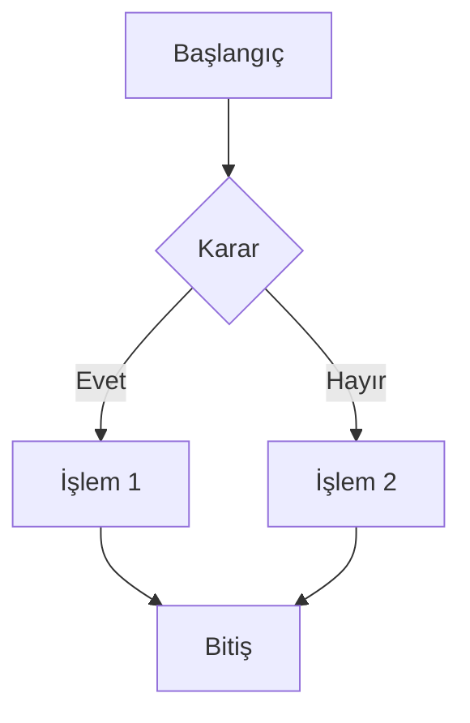
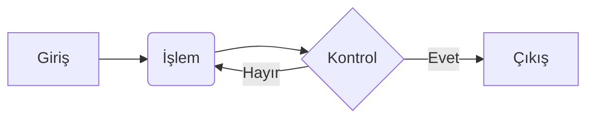
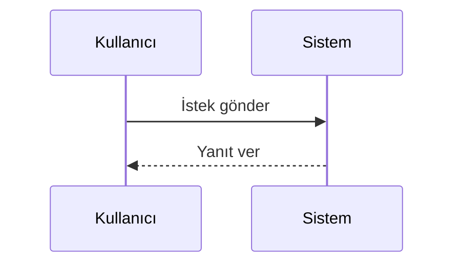

# Diyagram Örneği

Mermaid diyagramını aşağıdaki gibi oluşturabilirsiniz:

## Diğer Diyagram Tipleri

Akış şeması:

Sıralı diyagram:

## İpuçları

1. Diyagramı üç backtick ve "mermaid" kelimesi ile başlatın
2. Diyagram tipini belirtin (graph, flowchart, sequenceDiagram vb.)
3. Mermaid sözdizimini kullanarak diyagramınızı oluşturun
4. GitHub otomatik olarak diyagramı görselleştirecektir
